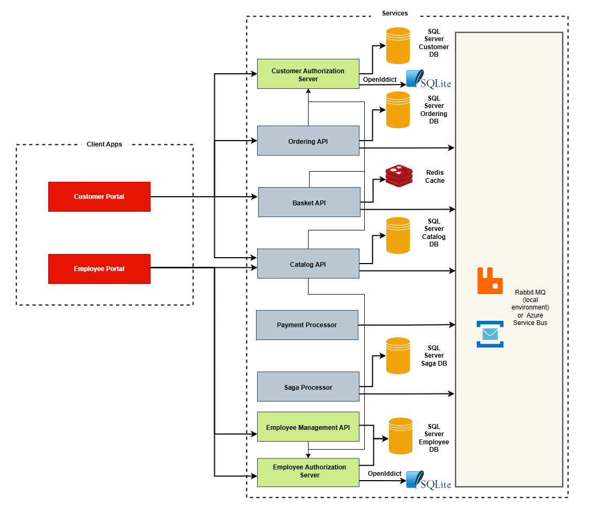
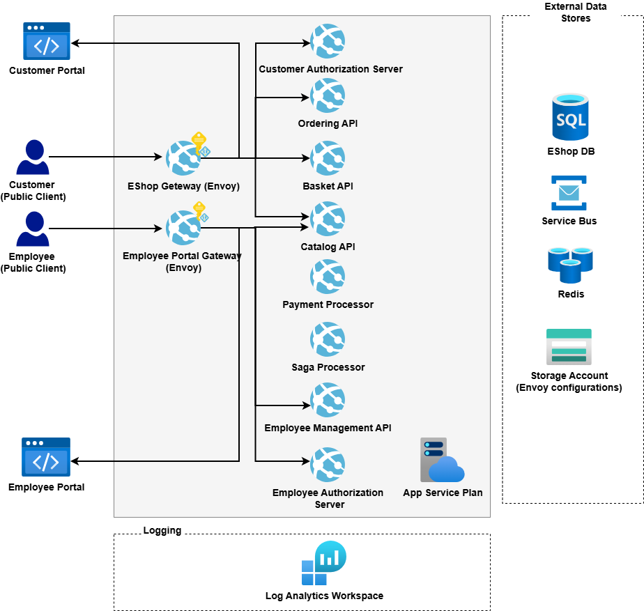
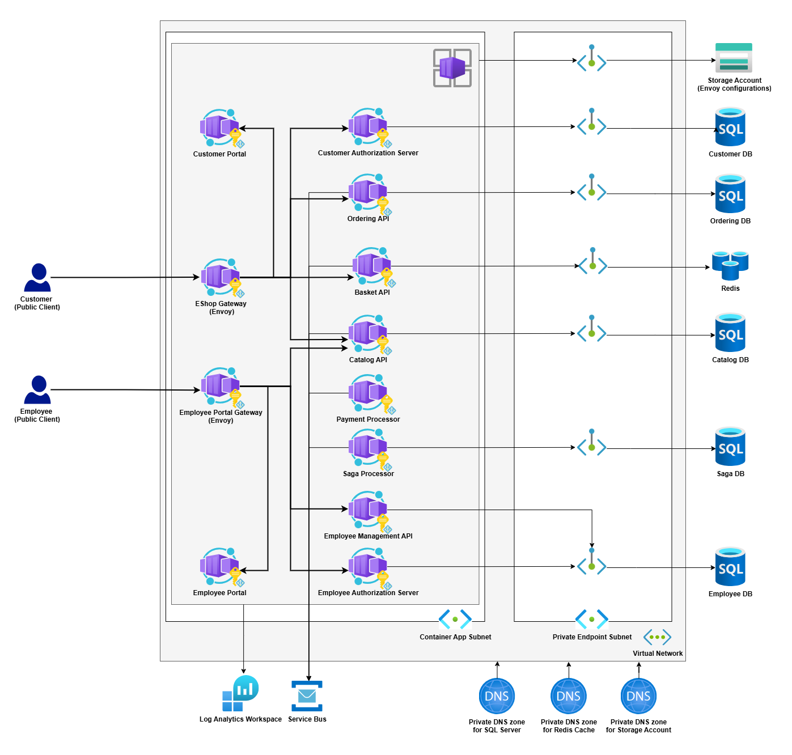
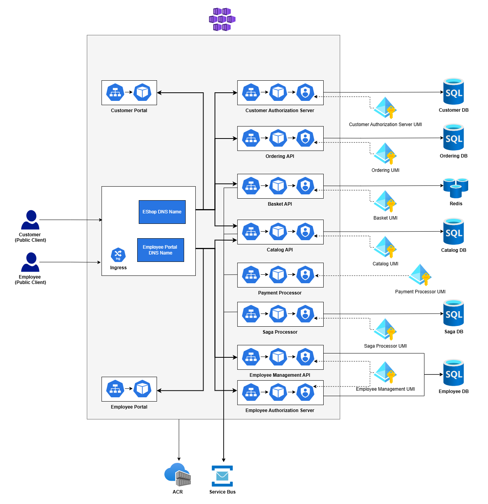

# eshop-on-microservices 

A microservices-based sample application that contains a set of **Azure DevOps** and **GitHub Actions** pipelines for deploying to various **Azure** hosting environments.



## Description

The project contains two Angular applications and a set of microservices implemented using DDD and the CQRS pattern. The microservices use RBAC to restrict access to certain endpoints for users with specific roles. Interaction between the microservices is implemented using the Saga pattern via a dedicated orchestration microservice. The integration leverages RabbitMQ in the local environment and Azure Service Bus in the cloud. As most components are designed to be independent, some code is duplicated.

The repository contains 3 main parts:

1.  ### eshop-api
    Backend. Each microservice, except the Saga, can be opened using its own solution file. Each solution includes a Docker Compose project for running components in the local environment. NSwag is used to generate TypeScript clients for Angular client applications at compile time.

     #### Microservices:
      * **Basket** - stores a customer's basket in the Redis cache. The API project contains controllers and Saga application components responsible for integrating with this microservice.
      * **Catalog** - responsible for catalog management. SQL Server and Entity Framework are used in the persistence layer. Endpoints for catalog modification are available only to employees with the `Sales Manager`  role. The API project contains controllers and components for integration with the Saga microservice.
      * **Customer** - an identity server based on the OpenIddict project. The persistence layer is implemented with Entity Framework and SQL Server for identities, and SQLite for OpenIddict entities.
      * **EmployeeManagement** - contains two parts:
        * **Authorization Server**  - an identity server based on the OpenIddict project. The persistence layer is implemented with Entity Framework and SQL Server for identities, and SQLite for OpenIddict entities.
        * **API**  - provides endpoints for modifying user properties.
      * **Ordering** - responsible for order management. The API project contains controllers and components for integration with the Saga microservice and uses Entity Framework with SQL Server.
      * **Payment** - emulates the payment provider. The project contains only Saga application components responsible for integrating with this microservice. The result of the payment operation is controlled by the 'payment.processPayment' environment variable.
      * **Saga** – a dedicated service that hosts the Saga orchestrator.

    #### Additional details: [Working with the eshop-on-microservices backend implementation](./eshop-api/README.md).

2. ###  eshop-ui-customer-portal
     An Angular application that provides eShop functionality for customers. Customers must log in to place orders.
     
     To run the application using Docker, see: [Using Docker with the eshop-ui-customer-portal](./eshop-ui-customer-portal/README.md)

3. ###  eshop-ui-employee-portal
    An Angular frontend for employees who manage the catalog. The application allows catalog changes only for users with the `Sales Manager` role. Additionally, users with the `Administrator` role can modify roles and passwords of other users. If integrated with an external identity provider (such as Microsoft Entra ID), user management functionality will be disabled. 

     To run the application using Docker, see:  [Using Docker with the eshop-ui-employee-portal](./eshop-ui-employee-portal/README.md)

## Running All Components Locally Using docker-compose

### Docker Compose:

*  Prepare https certificate for asp.net core services:

   ```pwsh
    $path = "$env:USERPROFILE\.aspnet\https\"

    if (!(Test-Path -path $path)) { New-Item -path $path -ItemType Directory }

    dotnet dev-certs https -ep "$path\eshop.pfx"  -p eshopPwd
    dotnet dev-certs https --trust

   ```
*  Build all apps:
    ```sh
    docker compose build --no-cache 
    ```

*  Run apps:
    ```sh
    docker compose up -d
    ```

 The Customer Portal App must be available at:   `http://localhost:4201/`

 The Employee Portal App must be available at: `http://localhost:4202/`

### Docker Compose With Envoy Proxy (Emulates Production Application Gateway Usage):

*  Prepare development certificates for Envoy Proxy:
   *  If `cert` folder not exists, execute:
        ```sh
        mkdir .dev_cert
        ```
   * Generate certificates:
        ```ps 
        openssl req -x509 -nodes -days 365 -newkey rsa:2048 `
        -out ".dev_cert/default_certificate.crt" `
        -keyout ".dev_cert/default_certificate.key" `
        -subj "/CN=localhost/O=default_certificate" `
        -addext "subjectAltName = DNS:localhost"
        ```
*  Build all apps:
    ```sh
     docker compose -f docker-compose.extended.yml build --no-cache
    ```
*  Run apps:
    ```sh
    docker compose -f docker-compose.extended.yml up -d
    ```

 The Customer Portal App must be available at:   `https://localhost:2443/`

 The Employee Portal App must be available at: `https://localhost:2453/`

### Azure Hosting Environments.

The repository contains a set of **Bicep** templates located in the `.azure` folders, **Azure DevOps** pipelines in the `.ado` folders, and **GitHub Actions workflows** in the `.github/workflows` folder. Pipelines located in the root folders provide deployment to the following environments:

* #### App services (zip deployment):



* #### Container apps (deploying Docker images hosted on Docker Hub):



* #### AKS (deploying Docker images hosted on ACR)



### CI/CD Setup:

* [Azure DevOps Guide](./.ado/README.md)

* [GitHub Actions Guide](./.github/README.md)

